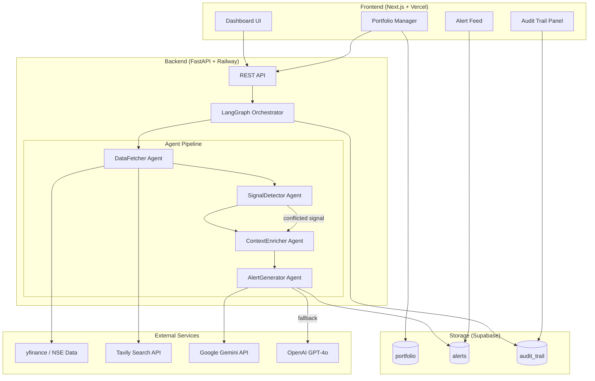
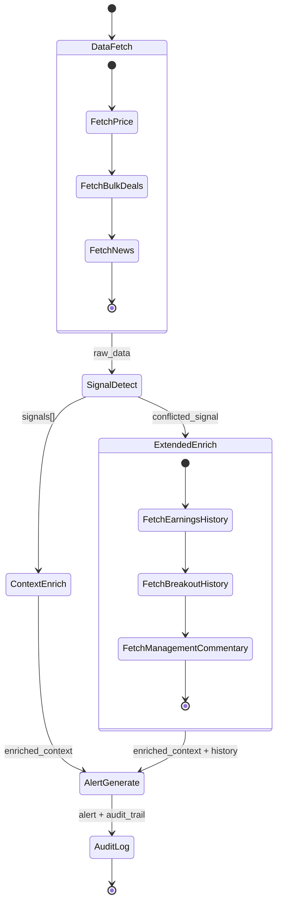

# Design Document: ET Investor Copilot

## Overview

ET Investor Copilot is a portfolio-aware signal intelligence system for Indian retail investors. It runs a four-agent LangGraph pipeline that fetches market data, detects signals, enriches them with portfolio context, and generates source-cited alerts with a full audit trail.

The system is designed for a solo 20-hour build targeting the ET AI Hackathon 2026. Every architectural decision prioritises: (1) demo reliability over production scale, (2) visible agent reasoning for judges, and (3) differentiated output quality via evidence chains and conflict resolution.

---

## Architecture

### High-Level System Diagram



### Agent Pipeline Flow



---

## Components and Interfaces

### FastAPI Backend

**Endpoints:**

| Method | Path | Description |
|--------|------|-------------|
| GET | `/api/portfolio` | Fetch user portfolio |
| POST | `/api/portfolio/holding` | Add a holding |
| DELETE | `/api/portfolio/holding/{ticker}` | Remove a holding |
| POST | `/api/analysis/run` | Trigger full pipeline for portfolio |
| POST | `/api/analysis/ticker` | Trigger pipeline for single ticker |
| GET | `/api/alerts` | Fetch alert feed (paginated) |
| GET | `/api/alerts/{alert_id}/audit` | Fetch audit trail for alert |

**Request/Response shapes** (Python TypedDicts, mirrored as TypeScript types on frontend):

```python
class RunAnalysisRequest(TypedDict):
    portfolio_id: str
    tickers: list[str]          # optional override; defaults to all holdings
    scenario: str | None        # "bulk_deal" | "breakout" | "macro" | None

class AlertResponse(TypedDict):
    alert_id: str
    ticker: str
    signal_type: str            # "bulk_deal" | "breakout_conflicted" | "macro_event"
    summary: str
    recommended_action: str
    confidence: str             # "Low" | "Medium" | "High"
    estimated_impact_inr_low: float | None
    estimated_impact_inr_high: float | None
    evidence_chain: list[EvidenceItem]
    bull_case: str | None
    bear_case: str | None
    what_to_watch: list[str] | None
    disclaimer: str
    # Personalization fields (Requirement 15)
    personalized_opening: str | None
    holding_duration_days: int | None
    unrealised_pnl_inr: float | None
    impact_pct_of_portfolio: float | None
    # Unreported signal flag (Requirement 16)
    unreported_signal: bool
    created_at: str

class EvidenceItem(TypedDict):
    label: str                  # e.g. "RSI(14) value"
    value: str                  # e.g. "78.3 as of 2026-01-15"
    source_name: str            # e.g. "NSE Bulk Deal Disclosure"
    source_url: str
    retrieved_at: str
```

### LangGraph Orchestrator

The orchestrator is a `StateGraph` with typed state:

```python
class PipelineState(TypedDict):
    # Input
    ticker: str
    portfolio: list[Holding]
    scenario_hint: str | None

    # DataFetcher output
    price_data: PriceData | None
    bulk_deals: list[BulkDeal]
    news_results: list[NewsResult]

    # SignalDetector output
    signals: list[Signal]
    conflict_report: ConflictReport | None

    # ContextEnricher output
    enriched_context: EnrichedContext | None
    portfolio_match: bool

    # AlertGenerator output
    alert: AlertResponse | None

    # Audit
    audit_trail: list[AuditStep]
    errors: list[str]
```

**Graph definition:**

```python
graph = StateGraph(PipelineState)
graph.add_node("data_fetch", data_fetcher_node)
graph.add_node("signal_detect", signal_detector_node)
graph.add_node("context_enrich", context_enricher_node)
graph.add_node("extended_enrich", extended_enricher_node)
graph.add_node("alert_generate", alert_generator_node)
graph.add_node("audit_log", audit_log_node)

graph.set_entry_point("data_fetch")
graph.add_edge("data_fetch", "signal_detect")
graph.add_conditional_edges(
    "signal_detect",
    route_on_conflict,
    {"conflicted": "extended_enrich", "normal": "context_enrich"}
)
graph.add_edge("extended_enrich", "alert_generate")
graph.add_edge("context_enrich", "alert_generate")
graph.add_edge("alert_generate", "audit_log")
graph.add_edge("audit_log", END)
```

### DataFetcher Agent

Responsibilities: yfinance price/volume/RSI fetch, NSE bulk deal scrape, Tavily news search.

```python
async def data_fetcher_node(state: PipelineState) -> PipelineState:
    ticker = state["ticker"]
    audit = []

    # 1. Price + technicals via yfinance
    try:
        price_data = await fetch_price_data(ticker)   # RSI computed via pandas-ta
        audit.append(AuditStep(agent="DataFetcher", action="fetch_price",
                               source_url=f"yfinance:{ticker}", ...))
    except Exception as e:
        price_data = await gemini_grounding_fallback(ticker)
        audit.append(AuditStep(..., note=f"yfinance failed: {e}, used Gemini fallback"))

    # 2. Bulk deals
    bulk_deals = await fetch_nse_bulk_deals(ticker)

    # 3. News + filings via Tavily
    news = await tavily_search(f"{ticker} NSE filing bulk deal earnings")

    return {**state, "price_data": price_data, "bulk_deals": bulk_deals,
            "news_results": news, "audit_trail": state["audit_trail"] + audit}
```

### SignalDetector Agent

Pure logic — no LLM calls. Deterministic signal classification.

```python
def signal_detector_node(state: PipelineState) -> PipelineState:
    signals = []
    conflict_report = None

    pd = state["price_data"]
    if pd and pd.close >= pd.week52_high and pd.volume > pd.avg_volume_20d * 1.2:
        sig = Signal(type="breakout", ticker=state["ticker"], flags=[])
        if pd.rsi14 > 70:
            sig.flags.append(Flag(name="overbought", value=pd.rsi14, direction="bearish"))
        if fii_reduction_detected(state):
            sig.flags.append(Flag(name="fii_reduction", value=..., direction="bearish"))
        signals.append(sig)

    for deal in state["bulk_deals"]:
        if is_promoter_sell(deal) and deal.pct_equity > 1.0:
            signals.append(Signal(type="bulk_deal_promoter_sell", ...))

    # Conflict detection
    for sig in signals:
        if len([f for f in sig.flags if f.direction == "bearish"]) >= 2:
            conflict_report = build_conflict_report(sig)
            sig.is_conflicted = True

    return {**state, "signals": signals, "conflict_report": conflict_report}
```

### ContextEnricher Agent

Fetches historical context. For conflicted signals, takes the extended path.

```python
async def context_enricher_node(state: PipelineState) -> PipelineState:
    ticker = state["ticker"]
    portfolio_match = any(h.ticker == ticker for h in state["portfolio"])

    enriched = EnrichedContext(portfolio_match=portfolio_match)

    for sig in state["signals"]:
        if sig.type == "bulk_deal_promoter_sell":
            enriched.eps_trend = await fetch_eps_trend(ticker, quarters=4)
            enriched.mgmt_commentary = await tavily_search(
                f"{ticker} management commentary earnings call site:bseindia.com OR site:nseindia.com"
            )

        if portfolio_match:
            holding = get_holding(state["portfolio"], ticker)
            enriched.impact_inr = estimate_impact(sig, holding)

    return {**state, "enriched_context": enriched, "portfolio_match": portfolio_match}

async def extended_enricher_node(state: PipelineState) -> PipelineState:
    # Called only for conflicted signals
    base = await context_enricher_node(state)
    ticker = state["ticker"]

    # Additional: historical breakout success rate
    breakout_history = await fetch_breakout_history(ticker, years=2)
    base["enriched_context"].breakout_success_rate = breakout_history.success_rate_pct

    return base
```

### AlertGenerator Agent

LLM-powered. Uses structured prompts with Gemini primary, GPT-4o fallback.

```python
async def alert_generator_node(state: PipelineState) -> PipelineState:
    prompt = build_alert_prompt(state)   # see prompt templates below
    model_used = "gemini"

    try:
        raw = await gemini_generate(prompt)
        if not raw or len(raw.strip()) < 50:
            raise ValueError("Empty Gemini response")
    except Exception as e:
        raw = await openai_generate(prompt)
        model_used = "gpt-4o"
        state["audit_trail"].append(AuditStep(
            agent="AlertGenerator", action="llm_fallback",
            note=f"Gemini failed: {e}, switched to GPT-4o"
        ))

    alert = parse_alert_response(raw, state)
    alert.disclaimer = DISCLAIMER_TEXT

    # Personalized holding context (Requirement 15)
    if state.get("portfolio_match"):
        holding = get_holding(state["portfolio"], state["ticker"])
        if holding:
            total_portfolio_value = sum(
                h.quantity * h.current_price for h in state["portfolio"]
            )
            holding_duration_days = (datetime.utcnow() - holding.created_at).days
            unrealised_pnl = (holding.current_price - holding.avg_buy_price) * holding.quantity
            position_value = holding.quantity * holding.current_price
            impact_pct_of_portfolio = (
                abs(state["enriched_context"].impact_inr_high or 0) / total_portfolio_value * 100
                if total_portfolio_value > 0 else 0
            )
            alert.personalized_opening = (
                f"You've held {holding.ticker} for {holding_duration_days} days "
                f"at ₹{holding.avg_buy_price:,.0f} avg. "
                f"Today's {state['signals'][0].type} signal directly affects "
                f"your ₹{position_value/100000:.1f}L position."
            )
            alert.holding_duration_days = holding_duration_days
            alert.unrealised_pnl_inr = unrealised_pnl
            alert.impact_pct_of_portfolio = round(impact_pct_of_portfolio, 2)

    state["audit_trail"].append(AuditStep(
        agent="AlertGenerator", action="generate_alert",
        model=model_used, prompt_hash=hash(prompt), output_summary=alert.summary
    ))

    return {**state, "alert": alert}
```

**Prompt Templates:**

*Bulk Deal Alert Prompt:*
```
You are a financial analyst assistant for Indian retail investors.

SIGNAL: Promoter bulk deal sell
Ticker: {ticker}
Deal size: {pct_equity}% of equity at {discount}% discount to market price
Filing: {filing_url}
EPS trend (last 4Q): {eps_trend}
Management commentary: {mgmt_commentary}

Generate a structured alert with:
1. SUMMARY (2 sentences)
2. DISTRESS vs ROUTINE assessment with reasoning
3. RECOMMENDED ACTION with confidence (Low/Medium/High) — not a binary buy/sell
4. EVIDENCE CHAIN: list each data point with source URL
5. DISCLAIMER: "This is not licensed financial advice."

Format as JSON matching the AlertResponse schema.
```

*Conflicted Breakout Prompt:*
```
You are a financial analyst assistant for Indian retail investors.

SIGNAL: Breakout with conflicting indicators
Ticker: {ticker}
Price vs 52W High: {price} vs {week52_high} (BREAKOUT)
Volume: {volume} vs {avg_volume_20d} avg (above average)
RSI(14): {rsi14} (OVERBOUGHT >70)
FII change QoQ: {fii_change_pct}% (REDUCTION)
Historical breakout success rate (2Y): {success_rate}%

Generate a structured alert with:
1. SUMMARY (2 sentences)
2. BULL CASE: evidence for continued upside
3. BEAR CASE: evidence for reversal
4. RECOMMENDATION: confidence level only (Low/Medium/High), NOT a binary buy/sell
5. WHAT TO WATCH: 2-3 specific future data points to monitor
6. EVIDENCE CHAIN: each indicator with exact value, date, and source
7. DISCLAIMER

Format as JSON matching the AlertResponse schema.
```

---

### ModelRouter Component

Routes LLM tasks by complexity to minimise cost while preserving quality where it matters.

**Routing Table:**

| Task Type | Model | Rationale | Est. cost per call |
|-----------|-------|-----------|-------------------|
| Sector tagging | Gemini Flash | Simple classification, no nuance needed | ~$0.0001 |
| Signal type detection | Gemini Flash | Deterministic pattern matching | ~$0.0001 |
| Bulk deal promoter detection | Gemini Flash | Keyword + entity classification | ~$0.0002 |
| Standard alert generation (non-conflicted) | Gemini Pro | Structured output, moderate reasoning | ~$0.002 |
| Conflicted signal alert generation | GPT-4o | Complex multi-indicator reasoning required | ~$0.02 |

**Implementation:**

```python
class ModelRouter:
    ROUTING_TABLE = {
        "sector_tagging":           ("gemini-flash", 0.0001),
        "signal_type_detection":    ("gemini-flash", 0.0001),
        "promoter_detection":       ("gemini-flash", 0.0002),
        "standard_alert":           ("gemini-pro",   0.002),
        "conflicted_alert":         ("gpt-4o",       0.02),
    }
    GPT4O_COST = 0.02   # baseline cost if GPT-4o used for everything

    def route(self, task_type: str) -> tuple[str, float]:
        model, cost = self.ROUTING_TABLE[task_type]
        cost_saved = self.GPT4O_COST - cost
        return model, cost_saved

    def log_routing(self, task_type: str, audit_trail: list[AuditStep]) -> str:
        model, cost_saved = self.route(task_type)
        note = f"Used {model} for {task_type} — saved ~${cost_saved:.4f} vs GPT-4o"
        audit_trail.append(AuditStep(
            agent="ModelRouter", action="route",
            output_summary=note,
            model_used=model,
        ))
        return model
```

The `audit_log` node aggregates all routing decisions and appends a cumulative cost efficiency summary to the audit trail before writing to Supabase.

---

### BacktestEngine Component

Computes real historical breakout success rates from yfinance data. No hardcoded values.

**Algorithm:**

```python
@dataclass
class BacktestResult:
    ticker: str
    success_rate_pct: float | None   # null if sample_size < 1
    sample_size: int
    avg_gain_pct: float | None
    avg_loss_pct: float | None
    note: str | None                 # e.g. "Insufficient data"

async def compute_breakout_success_rate(ticker: str, years: int = 2) -> BacktestResult:
    hist = yf.Ticker(ticker).history(period=f"{years}y")
    if hist.empty:
        return BacktestResult(ticker=ticker, success_rate_pct=None,
                              sample_size=0, avg_gain_pct=None,
                              avg_loss_pct=None, note="No historical data")

    hist["rolling_52w_high"] = hist["Close"].rolling(252).max().shift(1)
    hist["avg_vol_20d"] = hist["Volume"].rolling(20).mean().shift(1)
    hist = hist.dropna()

    # Identify breakout days
    breakouts = hist[
        (hist["Close"] >= hist["rolling_52w_high"]) &
        (hist["Volume"] > hist["avg_vol_20d"] * 1.2)
    ]

    if len(breakouts) == 0:
        return BacktestResult(ticker=ticker, success_rate_pct=None,
                              sample_size=0, avg_gain_pct=None,
                              avg_loss_pct=None, note="No breakout events found")

    gains, losses = [], []
    for date in breakouts.index:
        future_date = date + pd.Timedelta(days=30)
        future_slice = hist[hist.index >= future_date]
        if future_slice.empty:
            continue
        future_price = future_slice.iloc[0]["Close"]
        pct_change = (future_price - hist.loc[date, "Close"]) / hist.loc[date, "Close"] * 100
        if pct_change > 5:
            gains.append(pct_change)
        else:
            losses.append(pct_change)

    total = len(gains) + len(losses)
    if total == 0:
        return BacktestResult(ticker=ticker, success_rate_pct=None,
                              sample_size=0, avg_gain_pct=None,
                              avg_loss_pct=None, note="Insufficient forward data")

    return BacktestResult(
        ticker=ticker,
        success_rate_pct=round(len(gains) / total * 100, 1),
        sample_size=total,
        avg_gain_pct=round(sum(gains) / len(gains), 2) if gains else None,
        avg_loss_pct=round(sum(losses) / len(losses), 2) if losses else None,
        note=None,
    )
```

The `extended_enricher_node` calls `compute_breakout_success_rate` and stores the result in `enriched_context.backtest_result`. The alert prompt includes `success_rate_pct`, `sample_size`, `avg_gain_pct`, and `avg_loss_pct` so the LLM can reason about historical reliability.

---

### FilingScanner Component

Hunts for signals in NSE/BSE filings that have not yet appeared in mainstream news.

**Detection Logic:**

```python
async def scan_for_unreported_signals(ticker: str) -> FilingScanResult:
    # Step 1: Search NSE bulk deal filings directly
    filing_results = await tavily_search(
        f"site:nseindia.com/companies-listing/corporate-filings/bulk-deals {ticker}",
        days=1
    )

    if not filing_results:
        return FilingScanResult(ticker=ticker, has_filing=False, is_unreported=False)

    # Step 2: Cross-reference against news in last 24 hours
    news_results = await tavily_search(
        f"{ticker} bulk deal insider trade",
        days=1,
        exclude_domains=["nseindia.com", "bseindia.com"]
    )

    is_unreported = len(filing_results) > 0 and len(news_results) == 0

    return FilingScanResult(
        ticker=ticker,
        has_filing=True,
        filing_url=filing_results[0].url,
        is_unreported=is_unreported,
        news_count=len(news_results),
    )

@dataclass
class FilingScanResult:
    ticker: str
    has_filing: bool
    filing_url: str | None = None
    is_unreported: bool = False
    news_count: int = 0
```

When `is_unreported=True`, the `SignalDetector` sets `signal.is_unreported = True` and the `AlertGenerator` sets `alert.unreported_signal = True`. The alert's priority rank is boosted by 1 position relative to equivalent reported signals.

The `AlertCard` UI renders a `🔍 Unreported Signal` badge (amber background, dark text) when `alert.unreported_signal === true`.

---

## Data Models

### Supabase Schema

```sql
-- Portfolio holdings
CREATE TABLE holdings (
    id UUID PRIMARY KEY DEFAULT gen_random_uuid(),
    user_id TEXT NOT NULL DEFAULT 'demo_user',
    ticker TEXT NOT NULL,
    quantity NUMERIC NOT NULL,
    avg_buy_price NUMERIC NOT NULL,
    created_at TIMESTAMPTZ DEFAULT NOW(),   -- used for holding duration (Requirement 15)
    UNIQUE(user_id, ticker)
);

-- Generated alerts
CREATE TABLE alerts (
    id UUID PRIMARY KEY DEFAULT gen_random_uuid(),
    ticker TEXT NOT NULL,
    signal_type TEXT NOT NULL,
    summary TEXT NOT NULL,
    recommended_action TEXT,
    confidence TEXT,
    estimated_impact_inr_low NUMERIC,
    estimated_impact_inr_high NUMERIC,
    evidence_chain JSONB,
    bull_case TEXT,
    bear_case TEXT,
    what_to_watch JSONB,
    disclaimer TEXT NOT NULL,
    -- Personalization fields (Requirement 15)
    personalized_opening TEXT,
    holding_duration_days INTEGER,
    unrealised_pnl_inr NUMERIC,
    impact_pct_of_portfolio NUMERIC,
    -- Unreported signal flag (Requirement 16)
    unreported_signal BOOLEAN DEFAULT FALSE,
    created_at TIMESTAMPTZ DEFAULT NOW()
);

-- Audit trail steps
CREATE TABLE audit_trail (
    id UUID PRIMARY KEY DEFAULT gen_random_uuid(),
    alert_id UUID REFERENCES alerts(id),
    agent_name TEXT NOT NULL,
    action TEXT NOT NULL,
    source_urls JSONB,
    model_used TEXT,
    fallback_occurred BOOLEAN DEFAULT FALSE,
    fallback_reason TEXT,
    output_summary TEXT,
    -- Model routing fields (Requirement 13)
    task_type TEXT,
    estimated_cost_saved NUMERIC,
    timestamp TIMESTAMPTZ DEFAULT NOW()
);
```

### Python Data Classes

```python
@dataclass
class Holding:
    ticker: str
    quantity: float
    avg_buy_price: float
    created_at: datetime = field(default_factory=datetime.utcnow)  # for holding duration (Req 15)
    current_price: float = 0.0  # populated at portfolio view time

@dataclass
class PriceData:
    ticker: str
    close: float
    volume: int
    avg_volume_20d: float
    week52_high: float
    week52_low: float
    rsi14: float
    source_url: str
    retrieved_at: datetime

@dataclass
class BulkDeal:
    ticker: str
    client_name: str
    deal_type: str          # "BUY" | "SELL"
    quantity: int
    price: float
    pct_equity: float
    is_promoter: bool
    filing_url: str
    deal_date: date

@dataclass
class Signal:
    type: str               # "breakout" | "bulk_deal_promoter_sell" | "macro_event"
    ticker: str
    flags: list[Flag]
    is_conflicted: bool = False
    is_unreported: bool = False     # set by FilingScanner (Requirement 16)

@dataclass
class ConflictReport:
    ticker: str
    bull_indicators: list[Flag]
    bear_indicators: list[Flag]

@dataclass
class EnrichedContext:
    portfolio_match: bool
    eps_trend: list[float] | None = None
    mgmt_commentary: str | None = None
    breakout_success_rate: float | None = None
    impact_inr_low: float | None = None
    impact_inr_high: float | None = None
    backtest_result: "BacktestResult | None" = None   # full backtest (Requirement 14)
    impact_pct_of_portfolio: float | None = None      # Requirement 15

@dataclass
class BacktestResult:
    ticker: str
    success_rate_pct: float | None
    sample_size: int
    avg_gain_pct: float | None
    avg_loss_pct: float | None
    note: str | None = None

@dataclass
class FilingScanResult:
    ticker: str
    has_filing: bool
    filing_url: str | None = None
    is_unreported: bool = False
    news_count: int = 0

@dataclass
class AuditStep:
    agent: str
    action: str
    source_urls: list[str] = field(default_factory=list)
    model_used: str | None = None
    fallback_occurred: bool = False
    fallback_reason: str | None = None
    output_summary: str | None = None
    timestamp: datetime = field(default_factory=datetime.utcnow)
```

---


## Correctness Properties

*A property is a characteristic or behavior that should hold true across all valid executions of a system — essentially, a formal statement about what the system should do. Properties serve as the bridge between human-readable specifications and machine-verifiable correctness guarantees.*

---

### Property 1: Portfolio add/persist round-trip
*For any* valid ticker, quantity, and average buy price, adding a holding and then reading the portfolio from Supabase should return a holding with the same ticker, quantity, and price.
**Validates: Requirements 1.1, 1.3**

---

### Property 2: Portfolio remove restores state
*For any* portfolio with at least one holding, adding a holding and then removing it should return the portfolio to its original state (same length and same tickers).
**Validates: Requirements 1.2**

---

### Property 3: Invalid ticker rejection
*For any* string that is not a valid NSE/BSE ticker (e.g., empty string, numeric-only, >10 chars), the Portfolio_Manager should reject the addition and leave the portfolio unchanged.
**Validates: Requirements 1.4**

---

### Property 4: Portfolio view field completeness
*For any* holding in the portfolio, the view response object should contain non-null values for current_price, day_change_pct, and unrealised_pnl.
**Validates: Requirements 1.5**

---

### Property 5: PriceData completeness
*For any* valid NSE/BSE ticker, the DataFetcher should return a PriceData object where close, volume, avg_volume_20d, week52_high, week52_low, and rsi14 are all non-null and within plausible ranges (price > 0, volume > 0, 0 ≤ rsi14 ≤ 100).
**Validates: Requirements 2.1**

---

### Property 6: BulkDeal object completeness
*For any* bulk deal returned by the DataFetcher, the BulkDeal object should have non-null values for ticker, client_name, deal_type, quantity, price, pct_equity, and filing_url.
**Validates: Requirements 2.2**

---

### Property 7: News results bounded and sourced
*For any* Tavily search invocation, the result list should have length ≤ 5, and every item in the list should have a non-empty source_url.
**Validates: Requirements 2.3**

---

### Property 8: yfinance fallback on failure
*For any* ticker where yfinance raises an exception, the DataFetcher should still return a non-null PriceData (via Gemini fallback) and the audit trail should contain an entry with fallback_occurred=True.
**Validates: Requirements 2.4**

---

### Property 9: Audit trail records source URLs (edge case: empty Tavily)
*For any* DataFetcher invocation (including when Tavily returns zero results), the audit trail should contain at least one entry with a non-empty source_url, and no unhandled exception should be raised.
**Validates: Requirements 2.5, 2.7**

---

### Property 10: Breakout signal classification
*For any* PriceData where close ≥ week52_high and volume > avg_volume_20d × 1.2, the SignalDetector should include exactly one signal of type "breakout" in the output signals list.
**Validates: Requirements 3.1**

---

### Property 11: Promoter sell signal classification
*For any* BulkDeal where is_promoter=True and pct_equity > 1.0, the SignalDetector should include exactly one signal of type "bulk_deal_promoter_sell" in the output signals list.
**Validates: Requirements 3.2**

---

### Property 12: Conflicting flag attachment
*For any* breakout signal where rsi14 > 70, the signal's flags list should contain an overbought flag; and for any breakout signal where fii_change_qoq < -1.0, the flags list should contain a fii_reduction flag.
**Validates: Requirements 3.3, 3.4**

---

### Property 13: Conflict detection threshold
*For any* signal with ≥ 2 bearish flags, is_conflicted should be True and conflict_report should be non-null with non-empty bull_indicators and bear_indicators lists.
**Validates: Requirements 3.5, 10.1**

---

### Property 14: Macro event sector tagging
*For any* macro event signal and any portfolio, the set of tagged tickers should be a subset of the portfolio tickers whose sector matches the event's affected sector.
**Validates: Requirements 3.6**

---

### Property 15: Portfolio match flag accuracy
*For any* signal ticker and any portfolio, portfolio_match should equal True if and only if the ticker appears in the portfolio's holdings list.
**Validates: Requirements 4.1**

---

### Property 16: Bulk deal enrichment completeness
*For any* bulk_deal_promoter_sell signal, the enriched context should have eps_trend as a list of exactly 4 floats and mgmt_commentary as a non-empty string, and the evidence_chain should contain an item with a filing source URL.
**Validates: Requirements 4.2, 9.4**

---

### Property 17: Breakout success rate for conflicted signals
*For any* conflicted signal, enriched_context.breakout_success_rate should be a float in the range [0.0, 100.0].
**Validates: Requirements 4.3**

---

### Property 18: Impact estimation for portfolio holdings
*For any* signal where portfolio_match=True, impact_inr_low and impact_inr_high should both be non-null, and impact_inr_low ≤ impact_inr_high.
**Validates: Requirements 4.4, 11.1**

---

### Property 19: Impact priority ranking
*For any* two macro event enriched contexts with different absolute impact values, the one with higher abs(impact_inr_high) should have a lower priority rank number (rank 1 = highest priority).
**Validates: Requirements 4.5**

---

### Property 20: Alert required fields completeness
*For any* enriched signal, the generated alert should have non-null values for signal_type, ticker, summary, recommended_action, confidence, disclaimer, and evidence_chain with length ≥ 1.
**Validates: Requirements 5.1, 9.1**

---

### Property 21: Bulk deal alert evidence chain
*For any* bulk deal alert, the evidence_chain should contain at least one item whose source_url contains "nseindia.com" or "bseindia.com", and the alert body should contain numeric values for pct_equity and discount.
**Validates: Requirements 5.2, 9.2**

---

### Property 22: Conflicted alert structure
*For any* conflicted signal alert, bull_case and bear_case should both be non-null non-empty strings, what_to_watch should be a list of length 2 or 3, and recommended_action should not equal "Buy" or "Sell" (case-insensitive).
**Validates: Requirements 5.3, 10.2, 10.3, 10.4**

---

### Property 23: Macro event alert impact fields
*For any* macro event alert where portfolio_match=True, estimated_impact_inr_low and estimated_impact_inr_high should both be non-null.
**Validates: Requirements 5.4**

---

### Property 24: Disclaimer invariant
*For any* generated alert, the disclaimer field should be a non-empty string containing the phrase "not licensed financial advice".
**Validates: Requirements 5.5**

---

### Property 25: LLM fallback behavior
*For any* alert generation where Gemini raises an exception or returns an empty response, the system should still produce a non-null alert (via GPT-4o), and the audit trail should contain an entry with fallback_occurred=True and a non-null fallback_reason.
**Validates: Requirements 5.6, 7.5**

---

### Property 26: Audit trail model recording
*For any* alert generation step, the audit trail should contain at least one entry with a non-null model_used field.
**Validates: Requirements 5.7, 7.3**

---

### Property 27: Conflicted signal routing
*For any* pipeline run where the signal is conflicted, the audit trail should contain an entry from the "extended_enrich" agent step, confirming the branching path was taken.
**Validates: Requirements 6.2**

---

### Property 28: Error recovery returns partial result
*For any* pipeline run where a single agent step raises an exception, the pipeline should return a non-null PipelineState with a non-empty errors list rather than propagating the exception.
**Validates: Requirements 6.3**

---

### Property 29: Pipeline persists to Supabase
*For any* completed pipeline run, querying Supabase for the alert_id should return the alert and at least one audit trail entry.
**Validates: Requirements 6.5, 7.4**

---

### Property 30: Audit trail step completeness
*For any* completed pipeline run, every entry in the audit trail should have non-null values for agent_name, action, and timestamp.
**Validates: Requirements 7.1**

---

### Property 31: RSI evidence numeric precision
*For any* alert that references RSI data, the evidence_chain item for RSI should contain a string representation of a numeric value (matching pattern `\d+\.?\d*`) and a date string (matching ISO 8601 pattern).
**Validates: Requirements 9.3**

---

### Property 32: Impact displayed as range
*For any* portfolio-holding alert, estimated_impact_inr_low should be strictly less than estimated_impact_inr_high (the impact is a range, not a point estimate).
**Validates: Requirements 11.2**

---

### Property 33: Alert feed sorted by impact
*For any* list of alerts with non-null impact values, the alerts returned by the feed endpoint should be ordered such that abs(estimated_impact_inr_high) is non-increasing from first to last.
**Validates: Requirements 11.3**

---

### Property 34: Non-portfolio alerts omit INR impact
*For any* signal where portfolio_match=False, estimated_impact_inr_low and estimated_impact_inr_high should both be null in the generated alert.
**Validates: Requirements 11.5**

---

### Property 35: Model routing — classification tasks use Gemini Flash
*For any* pipeline run, all audit trail entries with action="route" and task_type in {"sector_tagging", "signal_type_detection", "promoter_detection"} should have model_used="gemini-flash".
**Validates: Requirements 13.1**

---

### Property 36: Model routing — conflicted alerts use GPT-4o
*For any* pipeline run where the signal is conflicted, the audit trail should contain a routing entry with task_type="conflicted_alert" and model_used="gpt-4o".
**Validates: Requirements 13.1**

---

### Property 37: Model routing — cost savings are non-negative
*For any* routing decision logged in the audit trail, estimated_cost_saved should be ≥ 0 (routing to a cheaper model always saves money vs GPT-4o baseline).
**Validates: Requirements 13.3**

---

### Property 38: BacktestEngine — success rate in valid range
*For any* BacktestResult where sample_size ≥ 1, success_rate_pct should be a float in [0.0, 100.0], and avg_gain_pct and avg_loss_pct should be non-null.
**Validates: Requirements 14.3**

---

### Property 39: BacktestEngine — null result on zero sample
*For any* ticker where no breakout events are found in the historical data, BacktestResult.success_rate_pct should be null and sample_size should be 0.
**Validates: Requirements 14.4**

---

### Property 40: Personalized alert fields for portfolio holdings
*For any* alert where portfolio_match=True, holding_duration_days should be a non-negative integer, unrealised_pnl_inr should be non-null, and impact_pct_of_portfolio should be a float in [0.0, 100.0].
**Validates: Requirements 15.1**

---

### Property 41: Unreported signal priority boost
*For any* two alerts of the same signal type where one has unreported_signal=True and the other has unreported_signal=False, the unreported alert should have a strictly lower priority rank number (higher priority).
**Validates: Requirements 16.3**

---

### Property 42: FilingScanner cross-reference completeness
*For any* FilingScanResult, if has_filing=True and is_unreported=True, then news_count should equal 0; if is_unreported=False and has_filing=True, then news_count should be ≥ 1.
**Validates: Requirements 16.2**

---

## Error Handling

### Agent-Level Error Handling

Each agent node wraps its logic in a try/except block. On failure:
1. The error message is appended to `state["errors"]`
2. An AuditStep is written with the error details
3. The node returns the state as-is (partial result), allowing downstream nodes to handle gracefully

```python
async def safe_agent_node(node_fn, state: PipelineState) -> PipelineState:
    try:
        return await node_fn(state)
    except Exception as e:
        return {
            **state,
            "errors": state["errors"] + [f"{node_fn.__name__}: {str(e)}"],
            "audit_trail": state["audit_trail"] + [
                AuditStep(agent=node_fn.__name__, action="error", output_summary=str(e))
            ]
        }
```

### API Fallback Chain

| Primary | Fallback | Condition |
|---------|----------|-----------|
| yfinance | Gemini grounding search | Exception or timeout |
| Gemini LLM | OpenAI GPT-4o | Exception or empty response |
| NSE bulk deal scrape | Tavily search for filing | HTTP error |

### Frontend Error States

- Pipeline running: spinner with current step name
- Pipeline failed: error banner with partial results shown if available
- API timeout: retry button with exponential backoff (max 3 retries)

---

## Testing Strategy

### Dual Testing Approach

Both unit tests and property-based tests are required. They are complementary:
- Unit tests catch concrete bugs in specific scenarios (the three judging scenarios)
- Property tests verify universal correctness across all inputs

### Property-Based Testing

**Library**: `hypothesis` (Python) for backend agent logic.

Each property test runs a minimum of 100 iterations. Tests are tagged with the design property they validate.

```python
# Example: Property 10 - Breakout signal classification
# Feature: et-investor-copilot, Property 10: Breakout signal classification
@given(
    close=st.floats(min_value=1.0, max_value=10000.0),
    week52_high=st.floats(min_value=1.0, max_value=10000.0),
    volume=st.integers(min_value=1),
    avg_volume_20d=st.floats(min_value=1.0),
)
@settings(max_examples=100)
def test_breakout_signal_classification(close, week52_high, volume, avg_volume_20d):
    assume(close >= week52_high and volume > avg_volume_20d * 1.2)
    price_data = PriceData(close=close, week52_high=week52_high,
                           volume=volume, avg_volume_20d=avg_volume_20d, ...)
    state = make_state(price_data=price_data)
    result = signal_detector_node(state)
    assert any(s.type == "breakout" for s in result["signals"])
```

**Property test coverage** (one test per property, Properties 1–42):
- Properties 1–4: Portfolio CRUD operations
- Properties 5–9: DataFetcher output contracts
- Properties 10–14: SignalDetector classification logic
- Properties 15–19: ContextEnricher enrichment contracts
- Properties 20–26: AlertGenerator output contracts
- Properties 27–30: Orchestrator routing and error recovery
- Properties 31–34: Data quality and sorting invariants
- Properties 35–37: ModelRouter routing correctness and cost accounting
- Properties 38–39: BacktestEngine historical computation contracts
- Properties 40: Personalized alert field completeness
- Properties 41–42: FilingScanner unreported signal detection

### Unit Tests

**Framework**: `pytest` for backend, `vitest` for frontend.

Focus areas:
- The three judging scenario end-to-end flows (mocked external APIs)
- Edge cases: empty portfolio, zero bulk deals, Tavily returning no results
- LLM fallback: mock Gemini to raise, verify GPT-4o is called
- Disclaimer presence in all alert types
- Alert feed sort order with mixed impact values

### Frontend Tests

- Component rendering: AlertCard shows all required fields
- Audit trail panel expands on click
- Portfolio table renders with correct columns
- "Run Analysis" button triggers API call and shows progress indicator
